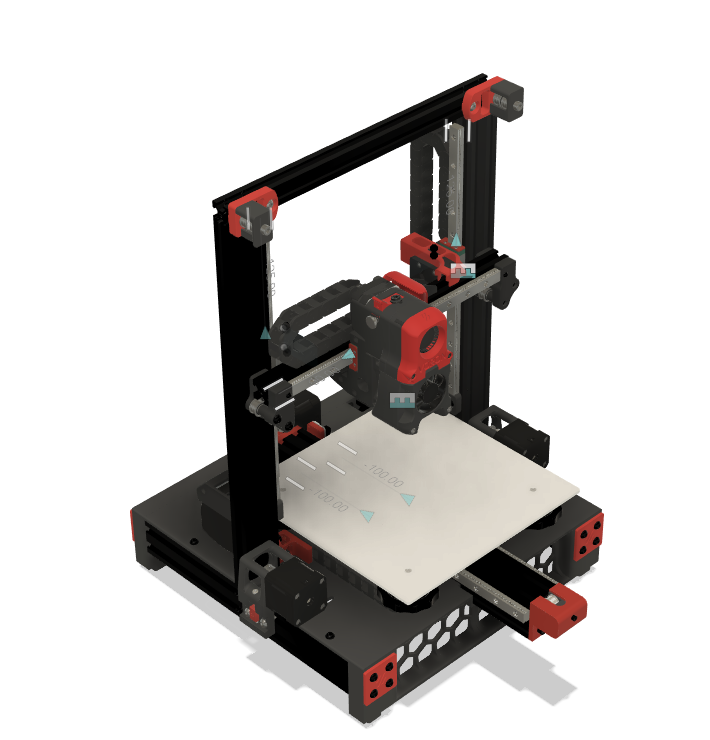

#  Ender 3 Pro to Switchwire Mod

This is a conversion of the Ender 3 Pro to a Switchwire type coreXZ printer.  My goal was to use most of the Ender 3 components while maintaining the core Voron design look and feel.
I had a lot of fun doing this and am willing to make any suggested changes.

## Overview
- This mod uses most of the key components from the Ender 3 Pro (E3P) while providing a coreXY capability.  The highlights of this include:
1. The frame is all E3P.
2. The electrons are the stock Switchwire ones, but the E3P 24V power supply is used.  I wanted to get all the electronics under the deck as this follows the Switchwire design.  I had to get a little creative with the mounts to make this work.  I did not include the LCD display.   Mainsail (MainsailOS) is so amazing, I never use the LCD on the Vowon 2.4 so I left it out.  I can easily be added.
3. The deck is easily printed in 4 sections.
4. The XZ and gantry are slightly modified from the Switchire baseline.  The X asis rail is 300mm and is a tight squeeze on the shorteded 2020 extrusion.  I wanted to keep the standard rail length in case I wanted to build a stock Switchwire.
5. The Y axis uses 2 rails.  I liked the look of it and it seemed more stable that way.  It also simplified the Y belt routing through the extrustion.  I also removed the springs on the bed corners and replaced them with spacers.  The spacers come off the E3P V-wheels.  With the bed mesh probing, this seemsed like a better approach than worrying about the bed changing positions if the knobs rotated/loosened.
6. This configuration also worked without too much modification to the stock E3P wire lengths.

I have included several images and the Fusion 360 CAD model.  Full disclosure, I am just learning CAD, so my skills are somewhat limited.  I also added all the STL files.  I tried to keep all the Voron naming conventions.

To do:
1. I will try to work a BOM in the near future.  In general, the primary change is the additional rail.  I chose to use the LDO motor set, but I don't see a reason to not use the stock E3P steppers; except for the extruder motor.
2. I designed this for a future enclosure.  I am not sure how/when I will do this.  But, it might be nice to print ABS.
